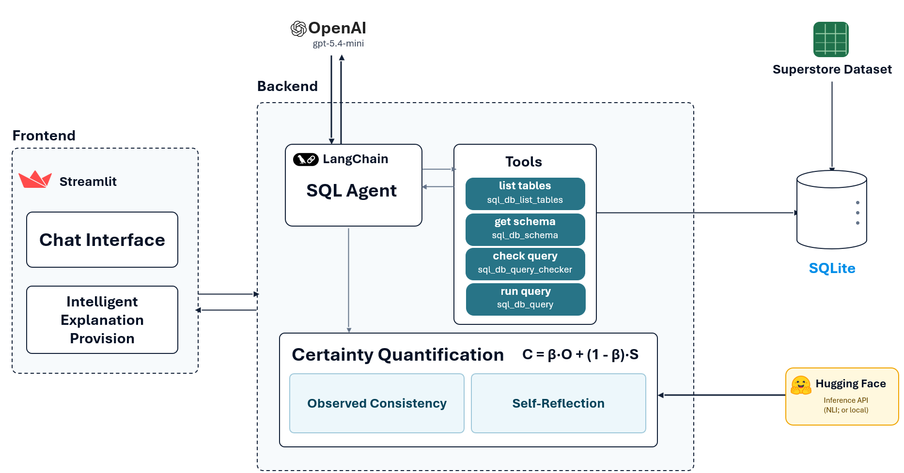

# GenAI Analytics Copilot

**Ask questions about a sales dataset, and get answers back.**

You type an ordinary question like
*"Which product has the highest sales last year?"*, and a GenAI analytics copilot figures out
the answer by looking through a sales dataset for you. 
It can also show you, step by step, *how* it found
the answer, and it quietly keeps track of how certain it is in each reply.

---

## Table of contents

- [What it can do](#what-it-can-do)
- [What it looks like](#what-it-looks-like)
- [How it works](#how-it-works)
- [Architecture](#architecture)
- [⭐ Setup guide](#-setup-guide)
  - [Before you start: what you'll need](#before-you-start-what-youll-need)
  - [Step-by-step setup](#step-by-step-setup)
  - [Starting the app again next time](#starting-the-app-again-next-time)
  - [Troubleshooting](#troubleshooting)
- [Running with Docker (alternative)](#running-with-docker-alternative)
- [A note on cost](#a-note-on-cost)
- [Keeping your keys safe](#keeping-your-keys-safe)
- [Technical reference](#technical-reference)
  - [Project layout](#project-layout)
  - [Configuration reference](#configuration-reference)
  - [How the explanation is shown (and the certainty gate)](#how-the-explanation-is-shown-and-the-certainty-gate)
  - [Certainty quantification](#certainty-quantification)
  - [Testing](#testing)
---

## What it can do

- **Answers questions.** about a sample sales dataset (the
  well-known *"Superstore"* dataset — orders, sales, profit, regions, returns,
  and so on).
- **Does the technical work.** Behind the scenes it writes and runs
  database queries (SQL) to find the answer, but you only ever see the question
  box and the answer.
- **Can explain its reasoning.** It can reveal a 
  step-by-step explanation of *how* it reached the answer.
- **Knows how sure it is.** For every answer that comes from the data, it
  calculates a behind-the-scenes certainty score and uses it to decide whether
  to offer the explanation.
- **Remembers the conversation** so you can ask follow-up questions.

**Example questions you can ask:**

> - *What were the total sales in 2021?*
> - *Which region has the highest profit?*
> - *List the top 3 products by sales.*
> - *Who is the regional manager for the West region?*
> - *How many orders were returned?*

---

## What it looks like

When you open the app you'll see a simple chat page titled **"GenAI Analytics Copilot"**. It greets you, and there's a box at the bottom that says
*"Ask me anything from the database!"*. Type a question, press Enter, and the
answer appears above. Depending on the answer, a **"See explanation"** button may
appear that reveals the step-by-step reasoning. A **"Clear chat history"** button
lives in the sidebar on the left.

---

## How it works

You don't need to understand any of this to use the app, but here's the gist:

```
            You type a question
                      │
                      ▼
        ┌──────────────────────────────┐
        │    GenAI Analytics Copilot   │   ← an AI "agent" powered by OpenAI
        └──────────────────────────────┘
                      │
        writes & runs database queries for you (read-only — it can't change data)
                      │
                      ▼
        ┌──────────────────────────────┐
        │   The sales data (Superstore │   ← a spreadsheet, loaded into a fast,
        │   dataset → mini database)   │      searchable mini-database
        └──────────────────────────────┘
                      │
                      ▼
              Copilot answer
        • optional step-by-step explanation
        • a hidden "how certain am I?" score
```

The project is built in **Python** using:

- **Streamlit** — turns the Python code into the chat website you see in your browser.
- **LangChain + OpenAI** — the "brain" that understands your question, writes the
  database query, and writes the answer.
- **SQLite** — the spreadsheet is loaded into this small, fast, read-only database
  so the assistant can search it.
- **PostgreSQL** — a separate database where every interaction is logged.
- **Certainty quantification** — measures how certain the assistant is about each answer.

---

## Architecture

The diagram below shows the whole system end-to-end: the **Streamlit** chat UI, the
**LangChain** SQL agent (OpenAI **gpt-5.4-mini**) with its SQL tools, the Superstore
dataset loaded into a read-only **SQLite** warehouse and the **certainty
quantification** (observed-consistency resampling with an NLI model, plus self-reflection).



---

## ⭐ Setup guide

This guide is written for a **less-technical audience**. Follow it
top to bottom and you'll be up and running. On Windows it takes about
**20–40 minutes** the first time (most of that is waiting for downloads).

> 💡 **What is the "terminal" / "command line"?** It's a window where you type
> commands instead of clicking buttons. On **Windows**, press the **Start** menu,
> type **PowerShell**, and click **Windows PowerShell**. On **Mac**, open the
> **Terminal** app (in Applications → Utilities). Keep this window open — you'll
> use it a few times below.

### Before you start: what you'll need

You'll create a few free accounts and copy some secret "keys" (think of them like
passwords the app uses to talk to other services).

| What | Why you need it                                                                                                          | Required?                                   | Where to get it |
|------|--------------------------------------------------------------------------------------------------------------------------|---------------------------------------------|------------------|
| **Python 3.12** | The programming language the app is written in                                                                           | ✅ Required                                  | https://www.python.org/downloads/ |
| **An OpenAI account + API key** | LLM that answers questions (this one costs a small amount of money per question — see [A note on cost](#a-note-on-cost)) | ✅ Required                                  | https://platform.openai.com/api-keys |
| **A PostgreSQL database** | Where conversations are logged. The easiest free option is **Neon** (cloud, nothing to install)                          | ✅ Required                                  | https://neon.tech |
| **A HuggingFace account + token** | Powers the "how certain am I?" feature                                                                                   | Recommended (the app still runs without it) | https://huggingface.co/settings/tokens |

> **Keep a notepad open.** As you collect each key below, paste it somewhere
> temporary (like Notepad). You'll put them all into one file at the end.

---

### Step-by-step setup

#### Step 1 — Install Python

1. Go to **https://www.python.org/downloads/** and download **Python 3.12**.
2. Run the installer. **Very important:** on the first screen, tick the box that
   says **"Add Python to PATH"** before clicking **Install Now**. (This lets your
   computer find Python from the terminal.)
3. To check it worked, open PowerShell (see the tip box above) and type:
   ```powershell
   python --version
   ```
   You should see something like `Python 3.12.x`. If you see an error, restart
   your computer and try again.

#### Step 2 — Get the project onto your computer

If you received the project as a **ZIP file**, right-click it and choose
**"Extract All…"**, then remember where you put the extracted folder.

If you know how to use **git**, you can instead clone it. Either way, you'll end
up with a folder named `llm_data_assistant` that contains files like
`streamlit_app.py` and `requirements.txt`.

#### Step 3 — Open the project folder in the terminal

In PowerShell, type `cd ` (the letters c, d, and a space), then drag the project
folder from File Explorer onto the PowerShell window — it will paste the folder's
location for you. Press **Enter**. For example:

```powershell
cd "C:\Users\you\Downloads\llm_data_assistant"
```

Your prompt should now show that folder's path. **Stay in this folder for all the
remaining steps.**

#### Step 4 — Create a "sandbox" for the project's tools

This keeps the project's software tidy and separate from everything else on your
computer. Run these two lines, one at a time:

```powershell
python -m venv .venv
.\.venv\Scripts\Activate.ps1
```

After the second line, your prompt should now start with **`(.venv)`**. That
means the sandbox is active. 🎉

> ⚠️ **If you see a red error about "running scripts is disabled"** when you run
> the second line, run this command once and then try the second line again:
> ```powershell
> Set-ExecutionPolicy -Scope Process -ExecutionPolicy RemoteSigned
> ```
> This only affects the current window and is safe.

> 💡 **Mac/Linux users:** the two commands are `python3 -m venv .venv` and then
> `source .venv/bin/activate`.

#### Step 5 — Install the project's software

Make sure your prompt still starts with `(.venv)`, then run:

```powershell
pip install -r requirements.txt
```

This downloads everything the app needs. **It can take 10–20 minutes** and prints
a lot of text — that's normal. It includes some large AI libraries (about 1–2 GB).

#### Step 6 — Get your OpenAI key

1. Sign up / log in at **https://platform.openai.com**.
2. Add a payment method under **Settings → Billing** (the AI charges a small
   amount per question — see [A note on cost](#a-note-on-cost)).
3. Go to **https://platform.openai.com/api-keys**, click **"Create new secret
   key"**, and **copy** the key (it starts with `sk-`). Paste it into your notepad.
   You won't be able to see it again later, so don't lose it.

#### Step 7 — Get a free database (Neon)

The app logs each conversation to a PostgreSQL database. The simplest option is
**Neon**, a free cloud database with nothing to install:

1. Go to **https://neon.tech** and sign up (you can use your Google account).
2. Create a new project (any name is fine). Neon creates a database for you
   automatically.
3. On your project dashboard, find the **Connection string** (sometimes under
   "Connect" or "Connection Details"). Copy the line that starts with
   `postgresql://…` — it includes your username, password, and address all in one.
   Paste it into your notepad.

> 💡 You do **not** need to create any tables. The app builds the table it needs
> automatically the first time it runs.

#### Step 8 — Get a HuggingFace token (recommended)

This powers the "how certain am I?" feature. It's free:

1. Sign up / log in at **https://huggingface.co**.
2. Go to **https://huggingface.co/settings/tokens** and click **"Create new
   token"**. A **Read** token is enough. Copy it (it starts with `hf_`) into your notepad.

> 💡 You can skip this for now if you want — the app will still run, it just won't
> calculate the certainty score until you add a token.

#### Step 9 — Create your settings file (`.env`)

The project includes a template called **`.env.example`**. You'll make a copy of
it named **`.env`** and fill in the keys you collected.

Run this to make the copy:

```powershell
Copy-Item .env.example .env
```

Now open the new **`.env`** file in a text editor (Notepad is fine — right-click
the file → **Open with** → **Notepad**), and replace the three placeholder lines
marked `<-- CHANGE THIS`:

- `OPENAI_API_KEY=` → paste your OpenAI key (Step 6)
- `DATABASE_URL=` → paste your Neon connection string (Step 7)
- `HF_API_TOKEN=` → paste your HuggingFace token (Step 8), or leave it for now

**Save the file.** Make sure the file is named exactly `.env` and **not**
`.env.txt` (in Notepad's Save dialog, set "Save as type" to **All Files**).

#### Step 10 — Start the app!

Back in PowerShell (still showing `(.venv)`), run:

```powershell
streamlit run streamlit_app.py
```

The first time, it may spend a minute or two getting ready (a message says
*"Initialising GenAI analytics copilot…"*). Then your web browser should open
automatically to the chat page. If it doesn't, open your browser and go to:

**http://localhost:8501**

Type a question like *"Which product has the highest sales?"* and press Enter.

#### Stopping the app

Go back to the PowerShell window and press **Ctrl + C**. The app shuts down. You
can close the browser tab.

---

### Starting the app again next time

You don't need to repeat the whole setup. Each time you want to use the app:

1. Open PowerShell.
2. Go to the project folder (Step 3): `cd "…\llm_data_assistant"`
3. Turn on the sandbox: `.\.venv\Scripts\Activate.ps1`
4. Start the app: `streamlit run streamlit_app.py`

---

### Troubleshooting

| What you see                                                  | What it usually means | How to fix it |
|---------------------------------------------------------------|-----------------------|----------------|
| `python` or `pip` "is not recognized"                         | Python isn't on your PATH | Reinstall Python (Step 1) and **tick "Add Python to PATH"**, then restart PowerShell |
| `running scripts is disabled on this system`                  | Windows is blocking the sandbox activation | Run `Set-ExecutionPolicy -Scope Process -ExecutionPolicy RemoteSigned`, then retry |
| `Failed to start the GenAI analytics copilot` on the web page | The app couldn't reach your database or OpenAI | Re-check `DATABASE_URL` and `OPENAI_API_KEY` in your `.env` (no extra spaces or quotes); make sure the database string is the full `postgresql://…` line |
| It says the workbook can't be found                           | The Excel file path is wrong | Make sure `(US)Sample-Superstore.xlsx` is in the project folder and `EXCEL_FILE_PATH` in `.env` matches its name |
| The answer appears but there's no certainty score             | The HuggingFace token is missing or invalid | Add a valid `HF_API_TOKEN` (Step 8), or switch `NLI_BACKEND=local` in `.env` (this downloads the AI libraries instead) |
| An OpenAI error mentioning a model name                       | Your account can't use the model in `.env` | Change `OPENAI_MODEL` in `.env` to a model your account can access |
| The browser didn't open                                       | Normal sometimes | Open it yourself and go to http://localhost:8501 |

---

## Running with Docker (alternative)

If you already use **Docker**, you can run the app *and* a local PostgreSQL
database together with one command — no Python setup or Neon account needed.

```bash
# 1. Put your OpenAI key in the environment (or in a .env file)
export OPENAI_API_KEY=sk-...

# 2. Build and start everything
docker compose up --build
```

Then visit **http://localhost:8501**. This starts a Postgres database and the app
side by side (see `compose.yaml`).

> ⚠️ The Docker setup mounts the workbook from a `streamlit_agent/` folder. If you
> go this route, place `(US)Sample-Superstore.xlsx` inside a `streamlit_agent/`
> folder (or adjust `EXCEL_FILE_PATH` and the volume mount in `compose.yaml` to
> point at the file's actual location).

---

## A note on cost

OpenAI's LLM is a paid service — you pay OpenAI a small amount each time the
assistant answers a question. One things to know:

- **The certainty feature multiplies the cost.** To measure how sure it is, the
  assistant quietly answers each question several extra times and runs a few
  self-checks — roughly **20+ extra AI calls per data question** with the default
  settings. If you want to cut cost, lower `CONFIDENCE_K` and `CONFIDENCE_ROUNDS`
  in your `.env` (e.g. `CONFIDENCE_K=2`).

Neon and HuggingFace are free for this kind of light use.

---

## Keeping your keys safe

Your `.env` file contains real secrets (your OpenAI key, database password, and
HuggingFace token). Treat it like a password:

- **Never share it** or paste it into emails, chats, or screenshots.
- It is already listed in `.gitignore`, so it **won't be uploaded** if the project
  is pushed to GitHub. The shareable template (`.env.example`) only has
  placeholders.
- If a key ever leaks, revoke/rotate it from the provider's website and create a
  new one.

---

# Technical reference

The rest of this document is for developers and researchers working on the code.

## Project layout

```
.
├── streamlit_app.py            Entry point (wires everything together)
├── (US)Sample-Superstore.xlsx  The sample dataset
├── .env.example                Configuration template (copy to .env)
├── Dockerfile / compose.yaml   Optional dev stack (app + Postgres)
├── pytest.ini                  Test runner config
├── requirements.txt            Runtime dependencies
├── requirements-dev.txt        Test dependencies
├── scripts/
│   └── check_reflection_calibration.py   Diagnostic for the confidence S-term
└── app/
    ├── config.py               Pydantic settings (env-driven)
    ├── logging_setup.py        Root logger configuration
    ├── prompts.py              System prompts and static strings
    ├── data_loader.py          Excel -> read-only SQLite
    ├── db/
    │   ├── pool.py             psycopg2 connection pool
    │   ├── schema.py           Idempotent table creation
    │   └── repository.py       InteractionRecord + InteractionRepository
    ├── agent/
    │   ├── factory.py          LangChain SQL agent (create_sql_agent)
    │   ├── tokens.py           Token counting + history truncation
    │   ├── steps.py            Prettifies intermediate agent steps
    │   └── explainer.py        Second LLM pass that simplifies steps
    ├── uncertainty/            Certainty quantification (BSDetector)
    │   ├── nli.py              NLI wrapper (local + inference, contradiction probs)
    │   ├── observed.py         Observed Consistency O
    │   ├── reflection.py       Self-Reflection Certainty S
    │   ├── score.py            C = beta*O + (1-beta)*S
    │   └── scorer.py           Orchestrates O + S for one answer
    └── ui/
        ├── session.py          Session state and query-param parsing
        └── chat.py             Chat rendering and per-turn orchestration
```

**Data flow.** On startup the app loads each worksheet of the Excel workbook into
an on-disk SQLite database (one table per sheet), reopens it **read-only**, and
hands it to a LangChain SQL agent. The agent inspects the schema, writes a SQLite
query, runs it, and summarises the result in natural language. A second LLM pass
turns the agent's intermediate steps into a friendly explanation. Each turn is
persisted to PostgreSQL with timing metadata.

## Configuration reference

All settings are read from environment variables (or a `.env` file) via
`app/config.py`. Names are case-insensitive.

| Variable | Default | Purpose |
|----------|---------|---------|
| `OPENAI_API_KEY` | *(required)* | OpenAI API key for the agent and explainer. |
| `OPENAI_MODEL` | `gpt-5.4-mini` | Model for both the SQL agent and the step explainer. |
| `DATABASE_URL` | *(required)* | PostgreSQL connection URL for the interaction log. |
| `INTERACTIONS_TABLE` | `interactions_experiment` | Name of the log table (auto-created). |
| `PG_POOL_MIN` / `PG_POOL_MAX` | `1` / `5` | psycopg2 connection-pool bounds. |
| `EXCEL_FILE_PATH` | `streamlit_agent/(US)Sample-Superstore.xlsx` | Source workbook the agent queries. |
| `SQLITE_DB_PATH` | `database.db` | Where the generated SQLite warehouse is written. |
| `MAX_TOTAL_TOKENS` / `RESERVED_TOKENS` | `14600` / `1000` | Token budget for the agent's chat history. |
| `EXPLANATION_MAX_TOKENS` / `EXPLANATION_TEMPERATURE` | `1000` / `0.1` | Step-explainer LLM call. |
| `CONFIDENCE_VIEW` | `numerical` | How certainty is recorded. |
| `CONFIDENCE_K` | `5` | Resamples for Observed Consistency (O). |
| `CONFIDENCE_ROUNDS` | `3` | Rounds for Self-Reflection Certainty (S). |
| `CONFIDENCE_ALPHA` | `0.8` | NLI-vs-exact-match trade-off inside O. |
| `CONFIDENCE_BETA` | `0.7` | O-vs-S trade-off in the final score C. |
| `CONFIDENCE_SAMPLE_TEMPERATURE` | `1.0` | Sampling temperature for O resamples. |
| `CONFIDENCE_USE_DIVERSITY_PROMPT` | `True` | Apply the Chain-of-Thought diversity prefix to O sampling. |
| `NLI_MODEL` | `FacebookAI/roberta-large-mnli` | HuggingFace NLI model for O. |
| `NLI_BACKEND` | `inference` | `inference` (hosted HTTP, needs a token) or `local` (torch/transformers). |
| `HF_API_TOKEN` | *(none)* | HuggingFace token; used when `NLI_BACKEND=inference`. |
| `NLI_INFERENCE_ENDPOINT` | *(auto)* | Override URL for the hosted NLI request. |
| `NLI_INFERENCE_TIMEOUT` | `60.0` | Per-request timeout (seconds) for the hosted NLI call. |

> Note: the code default for `EXCEL_FILE_PATH` points at `streamlit_agent/…`, but
> the bundled `.env.example` points at the workbook in the project root
> (`(US)Sample-Superstore.xlsx`), which is where the file actually lives. Keep the
> setting and the file's location in sync.

## How the explanation is shown (and the certainty gate)

`app/ui/chat.py` decides whether the step-by-step explanation is shown at all or
hidden behind a **"See explanation"** button.

## Certainty quantification

Each answer that is **grounded in a database query** is given a numeric certainty
score, following Chen & Mueller (2024), *"Quantifying Uncertainty in Answers from any Language Model and
Enhancing their Trustworthiness"*:

```
C = beta * O + (1 - beta) * S
```

- **O — Observed Consistency.** The SQL agent is re-run `CONFIDENCE_K` times at
  `CONFIDENCE_SAMPLE_TEMPERATURE` (with a Chain-of-Thought diversity prefix on the
  sampling runs, per the paper; toggle via `CONFIDENCE_USE_DIVERSITY_PROMPT`), and
  each resampled answer is compared to the reference answer with an NLI model
  (1 − p(contradiction), averaged across both directions per paper A.1, blended
  with an exact-match indicator via `CONFIDENCE_ALPHA`).
- **S — Self-Reflection Certainty.** The model is shown the SQL query that was run
  and the rows it returned, and asked over `CONFIDENCE_ROUNDS` rounds to estimate
  the probability the answer *faithfully reflects that result*, treating the
  database as the source of truth (rather than asking whether the fact is
  verifiable against outside knowledge — which fails for private data).
- The score is logged to PostgreSQL and used to gate the explanation button (see
  above). It is **not** rendered in the UI.

Greetings and off-topic replies (no SQL query) are **not** scored.

**Cost & latency.** Scoring multiplies the per-question OpenAI calls: roughly
`CONFIDENCE_K` full agent runs plus `CONFIDENCE_ROUNDS` reflection calls. With the
defaults that is ~20+ extra calls per data question. The resamples are currently
sequential.

**NLI model / hardware.** `NLI_MODEL` defaults to `FacebookAI/roberta-large-mnli`,
which the HuggingFace router serves as text-classification — so it works with
*either* backend. For a `local` run on a small CPU box, the lighter
`MoritzLaurer/DeBERTa-v3-base-mnli-fever-anli` (~750 MB) is a good swap; note it is
served as *zero-shot-classification* on the router, so it is **not** usable with
the `inference` backend.

**NLI backend (`NLI_BACKEND`).** Two interchangeable backends compute the
contradiction scores:

- `inference` (default) — calls the hosted **HuggingFace Inference Providers**
  router over HTTP, so it needs only `requests` and an API token (no
  torch/transformers). Useful where torch can't run (limited disk/RAM, no GPU,
  locked-down environments). Requires `NLI_MODEL` to be served as
  text-classification (the default is).
- `local` — runs `NLI_MODEL` on this machine via torch/transformers. No per-call
  network latency and works with any MNLI checkpoint (including the zero-shot
  DeBERTa one), but pulls in the heavy torch stack (~1.4 GB on first download).

Chen, J., & Mueller, J. (2024). Quantifying uncertainty in answers from any language model and enhancing their trustworthiness. In L.-W. Ku, A. Martins, & V. Srikumar (Eds.), Proceedings of the 62nd Annual Meeting of the Association for Computational Linguistics (Volume 1: Long Papers) (pp. 5186–5200). Association for Computational Linguistics. https://doi.org/10.18653/v1/2024.acl-long.283


## Testing

```bash
pip install -r requirements-dev.txt
pytest                 # full suite
pytest -m "not db"     # pure unit tests only (no Postgres needed)
pytest --cov=app       # with coverage
```

Pure tests cover `tokens.py`, `steps.py`, and the certainty math in
`app/uncertainty/` (the NLI model and LLM calls are injected as fakes). The
DB-backed test (`tests/test_repository.py`, marked `db`) spins up an ephemeral
PostgreSQL via `pytest-postgresql`, runs `initialize_schema`, and exercises the
repository end-to-end. It skips automatically if the PostgreSQL server binaries
(`pg_ctl`, `initdb`) are not on `PATH`.
